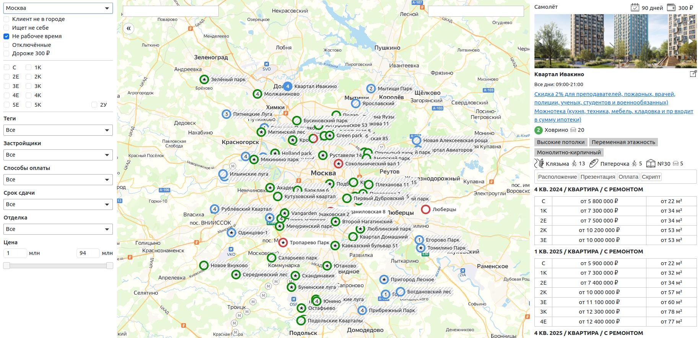

# Lidophone

Проект представляет собой сервис, который позволяет операторам, совершающим звонки клиентам, которые желают приобрести недвижимость, быстро ориентироваться в актуальных офферах и предоставлять клиентам информацию о том или ином жилом комплексе.

Админка написана на Laravel Nova.

Для запуска изучите [Makefile](Makefile):
- для начала: `make init-existing-project run-with-caution=!`;
- для последующих запусков: `make start`.
